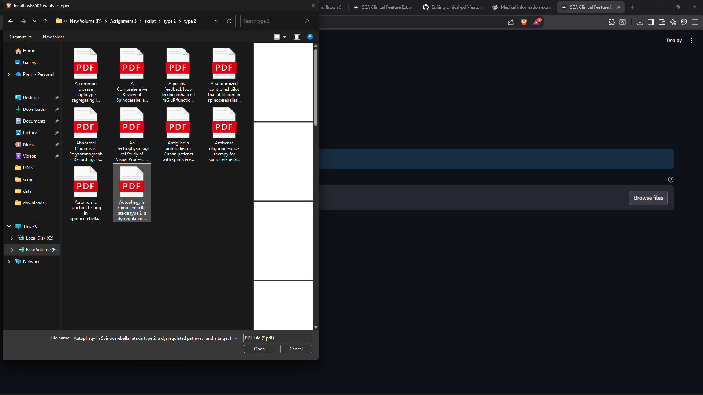
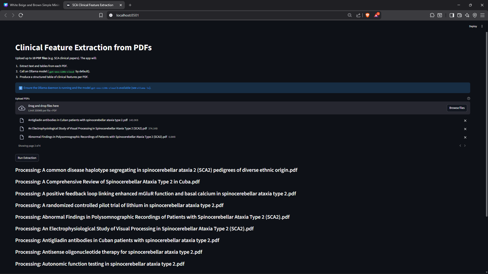
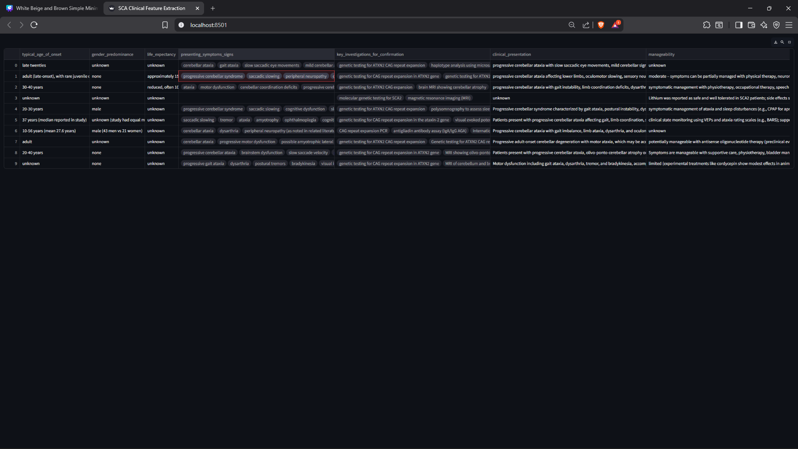

# 📄 Clinical PDF Feature Extraction Pipeline (LLM-Powered)

An end-to-end system to extract **structured clinical features** from biomedical PDFs using **LLMs**, with a **live interactive UI** for demos.

This project covers the full pipeline:
- Web scraping → PDF discovery
- Robust PDF text & table extraction
- Chunked LLM inference with caching
- Clean CSV outputs
- Streamlit UI for real-time interaction (≤10 PDFs)

---

## 🚀 Demo (UI Walkthrough)

### 1️⃣ Upload Clinical PDFs
Users can upload **up to 10 PDFs** at once using the web UI.



---

### 2️⃣ Live Extraction with Progress Tracking
Each PDF is processed independently:
- Text + tables extracted
- Content chunked
- LLM invoked with structured JSON prompts
- Progress shown per file



---

### 3️⃣ Structured Clinical Features (Final Output)
For each PDF, the system extracts fields such as:
- Typical age of onset  
- Gender predominance  
- Presenting symptoms  
- Key investigations  
- Treatability & manageability  

The results are displayed as a table and can be downloaded as CSV.




## 🧠 Extracted Clinical Fields

Each PDF yields a structured row with the following schema:

- `typical_age_of_onset`
- `gender_predominance`
- `life_expectancy`
- `presenting_symptoms_signs`
- `key_investigations_for_confirmation`
- `clinical_presentation`
- `manageability`
- `treatability`
- `onset_age`
- `file_name`
- `error` (empty if successful)

---

## 🏗️ Architecture Overview

```text
Web Scraping (Node.js)
        ↓
Direct PDF Resolution
        ↓
PDF Text + Table Extraction
(pdfplumber, camelot, tabula)
        ↓
Chunked LLM Inference (Ollama)
        ↓
JSON Validation + Merging
        ↓
CSV Output + Streamlit UI
```

Key design choices:
- Chunk-level caching to avoid re-querying the LLM
- Multiple table extraction backends for robustness
- Strict JSON validation for reliable downstream use
- Ephemeral file handling for privacy-safe demos

---

## 📁 Repository Structure

```text
clinical-pdf-feature-extraction/
├── python/
│   ├── extract_clinical_features.py
│   ├── ui_app.py
│
├── node/
│   ├── web_scrapper.js
│   ├── to_csv.js
│
├── pdfs/            # Temporary runtime uploads (empty in repo)
├── results/         # Debug traces & extracted tables
├── cache_ollama/    # LLM response cache
│
├── requirements.txt
├── .gitignore
└── README.md
```

---

## ⚙️ Setup Instructions

### 1️⃣ Clone & create virtual environment
```bash
git clone https://github.com/premdev1234/clinical-pdf-feature-extraction.git
cd clinical-pdf-feature-extraction
python -m venv .venv
```

### 2️⃣ Activate venv

**Windows**
```powershell
.\.venv\Scripts\Activate
```

**Linux / macOS**
```bash
source .venv/bin/activate
```

### 3️⃣ Install dependencies
```bash
pip install -r requirements.txt
```

---

## ▶️ Run the UI (Recommended)

```powershell
.\.venv\Scripts\python -m streamlit run python/ui_app.py
```

Open in browser:
```
http://localhost:8501
```

---

## 🔐 File Handling & Privacy

- Uploaded PDFs are stored in a temporary session directory
- Files are processed and removed automatically
- No PDFs or private data are committed to GitHub
- Only structured outputs are downloadable

---

## 🧩 System Dependencies (Important)

Some features require external tools:

- Ollama (LLM inference)
- Java 8+ (for tabula-py)
- Tesseract OCR (for scanned PDFs)
- Ghostscript (recommended for Camelot)

---

## 🎯 Use Cases

- Clinical literature mining  
- Rare disease phenotype summarization  
- Pre-processing for genotype–phenotype mapping  
- Structured inputs for downstream ML / research pipelines  

---

## 📜 License

MIT License

---

